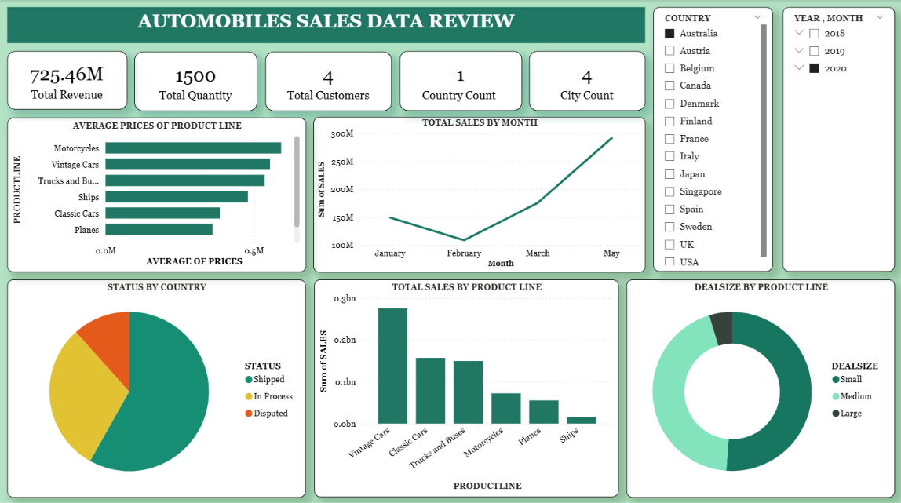

# Automobile Sales Analytics Dashboard

An interactive Power BI dashboard developed to analyze automobile sales performance, customer trends, product line insights, and revenue distribution across multiple countries and years.

---

## Project Overview

This project focuses on transforming raw automobile sales data into meaningful business insights using interactive visualizations and KPI-driven reporting techniques.

The dashboard helps analyze:
- Sales performance trends
- Product line contribution
- Customer distribution
- Deal size analysis
- Monthly revenue patterns
- Country-wise sales insights

---

## Key Features

- KPI Cards for Revenue, Quantity Ordered, Customers, Cities, and Countries
- Monthly Sales Trend Analysis
- Product Line Performance Comparison
- Deal Size Distribution Analysis
- Order Status Visualization
- Interactive Country and Year Filters
- Dynamic Dashboard Design

---

## Tools & Technologies Used

- Microsoft Power BI
- Data Visualization
- Business Intelligence
- KPI Reporting
- Dashboard Design

---

## Dataset Source

Dataset used in this project was sourced from Kaggle for educational and portfolio purposes.
https://www.kaggle.com/datasets/ddosad/auto-sales-data?resource=download

---

## Dashboard Preview

---

## Project Files

- Power BI Dashboard File (.pbix)
- Dataset Files
- Dashboard Screenshots
- README Documentation

---

## Learning Outcomes

This project helped improve my understanding of:
- Interactive Dashboard Development
- Data Storytelling
- KPI Analysis
- Business Intelligence Reporting
- Visual Analytics using Power BI

---

## Connect With Me

LinkedIn Profile:
www.linkedin.com/in/sandhya-mourya-a92475286
